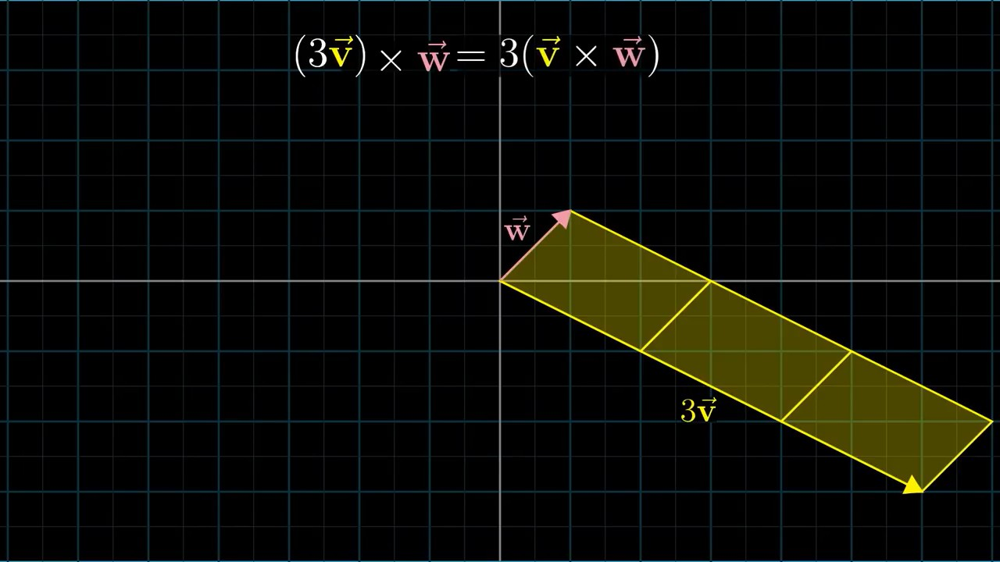
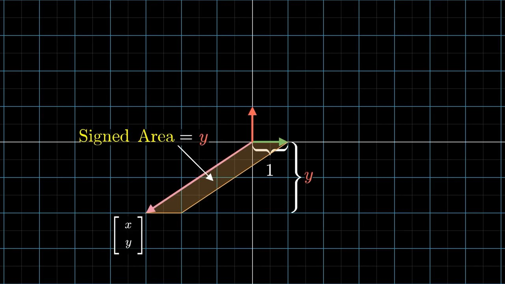

# 3Blue1Brown Essence of Linear Algebra Lecture Notes

- [3Blue1Brown Essence of Linear Algebra Lecture Notes](#3blue1brown-essence-of-linear-algebra-lecture-notes)
    - [3](#3)
    - [4](#4)
    - [5](#5)
    - [6](#6)
        - [Right Hand Axes](#right-hand-axes)
        - [Determinant Calculation](#determinant-calculation)
    - [7 Inverse Matrices, Column Space and Null Space uQhTuRlWMxw](#7-inverse-matrices-column-space-and-null-space-uqhturlwmxw)
    - [8 Nonsquare Matrices as Transformations Between Dimensions](#8-nonsquare-matrices-as-transformations-between-dimensions)
    - [9 Dot Products and Duality](#9-dot-products-and-duality)
    - [10 Cross Products](#10-cross-products)
        - [Treat Cross Products as Values](#treat-cross-products-as-values)
        - [Treat Cross Products as 3D Vectors](#treat-cross-products-as-3d-vectors)
    - [11 Cross Products in the Light of Linear Transformations](#11-cross-products-in-the-light-of-linear-transformations)
    - [12 Cramer's Rule, Explained Geometrically](#12-cramers-rule-explained-geometrically)

Playlist: <https://www.youtube.com/playlist?list=PLZHQObOWTQDPD3MizzM2xVFitgF8hE_ab>

## 3

Source: <https://www.youtube.com/watch?v=kYB8IZa5AuE>

**Linear transformation** in layman's terms: after a linear transformation, lines remain lines, and the origin stays fixed.
In other words, keep grid lines parallel and evenly spaced.

Linear transformation in formulae:

Linear transformations can be described using matrix multiplication.

Affine transformation: Same as linear transformation, except that the origin moves (linear transformation + translation).

## 4

**Composition** of multiple transformations `A @ B @ P`:

- Matrix multiplication of those individual transformation matrices
- The transformation of the rightward matrix `B` get applied first

## 5

Again, 3D transformation matrix's columns: new locations of the new unit vectors.

## 6

**Determinant** of a transformation: area (2D)/volume (3D) scaling factor.

Area scaling factor can be calculated by using square (0, 0, 1, 1):

- All squares have the same scaling factor
- Any area can be *approximated* by small enough squares

Values:

- 0 determinant ->
    - **reduce dimension**
    - Columns are linearly dependent
- Negative determinant -> "invert"/"flip" space

`det(AB) = det(A)det(B)`

### Right Hand Axes

Can no longer use right hand axes after the transformation: determinant < 0

### Determinant Calculation

## 7 Inverse Matrices, Column Space and Null Space uQhTuRlWMxw

Identity transformation: `inverse(A) @ A == I`

`det(A) == 0`: Not inversible.
Solutions don't exist if the 2 equations contradict:

Rank: New dimensionality.
"full rank"

**Null space**/**kernel**: The set of vectors that lands on the origin after the transformation.
Describes solutions of `A @ x == [[0], [0]]`.

## 8 Nonsquare Matrices as Transformations Between Dimensions

Example: 2D vector to 3D vector

Column space: a plane in 3D space

## 9 Dot Products and Duality

Dot product calculation using numbers:

Dot product calculation using projection: `len(w's projection on v) * len(v)`

- If `w`'s projection is opposite to `v`, the dot product is negative
- Perpendicular vector: dot product is 0

Projection is symmetric: `v . w == w . v`

Dot product usage: check if 2 vectors point in roughly the same direction.

Consider one of the vectors as a transformation matrix:

**Duality**: natural but surprising correspondence between 2 things.

Dual vector: likes the dot product, maps a 2D vector onto an 1D line.

## 10 Cross Products

### Treat Cross Products as Values

Basic definition: area of parallelogram

Asymmetric: `v ✖️ w == - w ✖️ v`

- 
- 

Basically, the unit vectors' placement introduces positive cross products:

That is because: cross products can be calculated using determinants:

Cross products are scalable:

### Treat Cross Products as 3D Vectors

The length of 3D cross products equals the area/determinant calculated above.

Direction of cross products: use right hand rule:

Calculation:

## 11 Cross Products in the Light of Linear Transformations

Cross product is the **dual vector** of `v` and `w`.
That it, it is a 3D to 1D linear transformation.

The dual vector equals the cross product vector:

Dual vector characteristics:

## 12 Cramer's Rule, Explained Geometrically

The solution for linear systems of equations (Cramer's Rule):

This is not the fastest solution.
E.g. [Gaussian Elimination](https://en.wikipedia.org/wiki/Gaussian_elimination) will always be faster.

Dot products before and after a transformation usually do not equal:
`v . w > 0` does not mean that `T(v) . T(w) > 0`.

Orthonormal transformation: rotation.

Axes in determinants:

Areas are scaled by the transformation matrix by the same amount.

