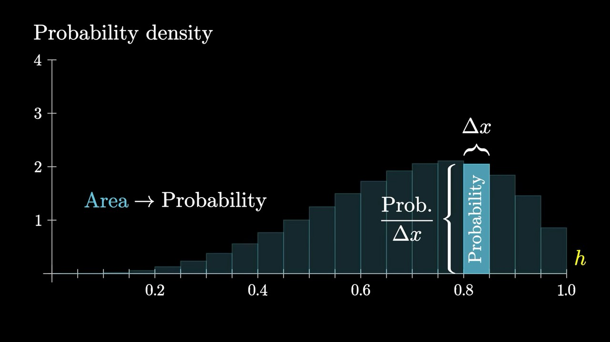

# Probabilities of Probabilities Lecture Notes

Playlist: <https://www.youtube.com/playlist?list=PLZHQObOWTQDOjmo3Y6ADm0ScWAlEXf-fp>

## 1 Binomial Distributions

Laplace's Rule of Succession:
Read Amazon ratings: pretend that you see 2 more ratings, a positive and a negative.

Binomial distribution "totals" formula:

## 2 Probability Density

Sum of P(head) should be 1.
But lim paradox:

`lim == 0` -> `sum == 0`

`lim > 0` -> `sum == infinity`

Total probability must be 1.
Paradox: lim probabilities cannot be either all 0 or larger than 0.

Instead, we don't focus on individual values, but on a **range** of values.

We don't use heights as probabilities.
Instead, the areas on the diagram now represent the probabilities.
This solves the `lim == 0` problem.

In this case, the y axis means probability per unit.

Go from big to small ranges (rectangles): shape of the probability distribution doesn't change.

Total area = 1

### Discrete vs Continuous Probabilities

- Discrete: sum
- Continuous: not sum, but **integral**

